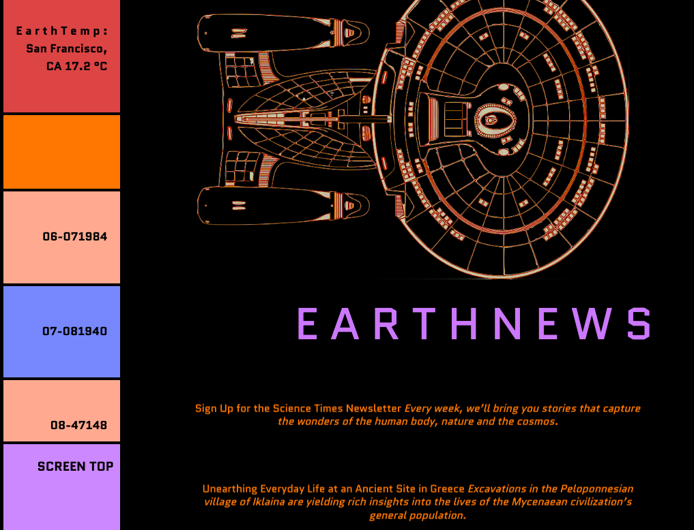

# _StarTrek Dash_

#### By _Chief Science Officer Ashe Urban Chief Medical Officer Caroline Cerussi Captian of Engineering Claire Thorington Councelor Kyle Chinick  Ensign Justin Peters Chief Engineer Liam Campbell_

## _A C# based Star Trek Dashboard_

## Table of Contents

[Technologies Used](#technologies-used)  
[Description](#description)  
[Setup/Installation Requirements](#setup-and-installation-requirements)  
[Known Bugs](#known-bugs)  
[License](#License)

## Technologies Used

* _C#_
* _.NET_
* _RestSharp_
* _SQL Workbench_
* _Entity Framework_
* _MVC_

---
## Description
_This is a Star Trek Themed Dashboard. Povides weather data for Portland, OR, grabs science news from the NYT Api and displays them all in one place in a slick StarTrek Themed space._

---
## Setup and Installation Requirements

<strong>Initial Setup</strong>

<ol>
<li>Copy the git repository url: https://github.com/lcmpbll/StarTrekDash
<li>Open a shell program and navigate to your desktop.
<li>Clone the repository for this project using the "git clone" command and including the copied URL.
<li>While still in the shell program, navigate to the root directory of the newly created file named "StarTrek_Dashboard".
<li>From the root directory, navigate to the "StarTrrekDash" directory.
 

<strong>SQL Workbench Configuration</strong>

<ol>
<li>Create an appsetting.json file in the "ParksApi" directory of the project*  
   <pre>StarTrek_Dashboard.Solution
   └── StarTrekDash
    └── appsetting.json</pre>
<li> Insert the following code** :  

<pre>{
   "Logging": {
    "LogLevel": {
      "Default": "Warning",
      "System": "Information",
      "Microsoft": "Information"
    }
  },
  "AllowedHosts": "*"
</pre>

<strong>To Run</strong>

Navigate to:  
   <pre>StarTrek_Dashboard
   └── <strong>StarTrekDash</strong></pre>

Run `$ dotnet restore` in the console. 
Run `$ dotnet database update` in the console. 
Run `$ dotnet run` in the console

 

This program was built using *`Microsoft .NET SDK 5.0.401`*, and may not be compatible with other versions. Your milage may vary.

## Known Bugs

## License

[Copyright](LICENSE) (c) _08-21-2022_ _Ashe Urban Caroline Cerussi Claire Thorington Kyle Chinnick Justin Peters Liam Campbell_